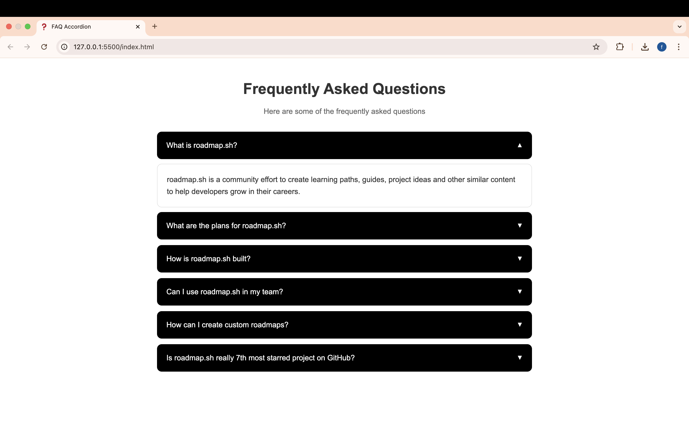

# FAQ Accordion

An interactive FAQ accordion built with HTML, CSS, and JavaScript. This project is part of the frontend learning path from [roadmap.sh](https://roadmap.sh/frontend).

## Live Demo
[View Demo](https://faizaazam-1.github.io/Accordion-JS/)

### Accordion - Preview

## Features
- Pure HTML, CSS, and JavaScript implementation
- Smooth animations
- Responsive design
- Interactive accordion functionality
- Clean and modern UI

## Project Requirements
This project is created following the requirements from:
[https://roadmap.sh/projects/accordion](https://roadmap.sh/projects/accordion)

## GitHub Actions
The project is automatically deployed using GitHub Pages. You can view the deployment status in the [Actions tab](https://github.com/faizaazam-1/Accordion-JS/actions).

## Author
Faiza Azam
- GitHub: [@faizaazam-1](https://github.com/faizaazam-1)
